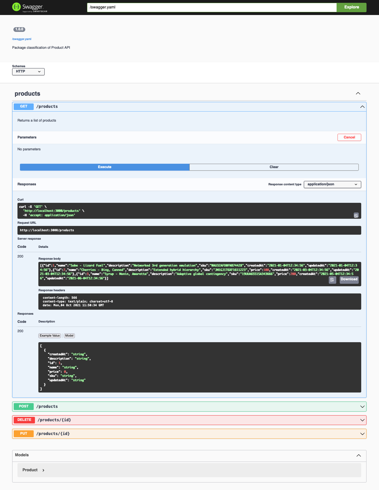

# ep-07: generate Swagger file

generated [swagger.yaml](./swagger.yaml)



```bash
# testing
go test -v ./...
# ?       github.com/chrischenyc/microservices-in-go/ep-06        [no test files]
# === RUN   TestProductValidator
# === RUN   TestProductValidator/it_should_not_return_error_for_Procut_with_all_required_fields
# === RUN   TestProductValidator/it_should_return_error_for_Procut_without_name
# === RUN   TestProductValidator/it_should_return_error_for_Procut_with_invalid_sku
# --- PASS: TestProductValidator (0.00s)
#     --- PASS: TestProductValidator/it_should_not_return_error_for_Procut_with_all_required_fields (0.00s)
#     --- PASS: TestProductValidator/it_should_return_error_for_Procut_without_name (0.00s)
#     --- PASS: TestProductValidator/it_should_return_error_for_Procut_with_invalid_sku (0.00s)
# PASS
# ok      github.com/chrischenyc/microservices-in-go/ep-06/data   (cached)
# ?       github.com/chrischenyc/microservices-in-go/ep-06/handlers       [no test files]

# start server at localhost:3000
go run main.go

# send os termination signal
ctrl^c

# expected output
#
# [api] 2021/09/14 17:07:04 received OS termination signal, gracefully shut down
# [api] 2021/09/14 17:07:04 http: Server closed
```

```bash
# testing in another terminal

curl http://localhost:3000/products | jq
# [
#   {
#     "id": 1,
#     "name": "Sobe - Lizard Fuel",
#     "description": "Networked 3rd generation emulation",
#     "sku": "WAU32AFD0FN874428",
#     "createdAt": "2021-01-04T12:34:56",
#     "updatedAt": "2021-01-04T12:34:56"
#   },
#   {
#     "id": 2,
#     "name": "Cherries - Bing, Canned",
#     "description": "Extended hybrid hierarchy",
#     "sku": "JM1GJ1T6XF1611223",
#     "price": 100,
#     "createdAt": "2021-03-04T12:34:56",
#     "updatedAt": "2021-03-04T12:34:56"
#   },
#   {
#     "id": 3,
#     "name": "Syrup - Monin, Amaretta",
#     "description": "Adaptive global contingency",
#     "sku": "19UUA65515A343666",
#     "price": 200,
#     "createdAt": "2021-05-04T12:34:56",
#     "updatedAt": "2021-06-04T12:34:56"
#   }
# ]

curl http://localhost:3000/products -XPOST -d '{"name":"new product", "description":"a brand new product", "sku": "abcdefg12345"}'
# Error validating product:
# Key: 'Product.SKU' Error:Field validation for 'SKU' failed on the 'sku' tag
# Key: 'Product.Price' Error:Field validation for 'Price' failed on the 'gt' tag

curl http://localhost:3000/products -XPOST -d '{"name":"new product", "description":"a brand new product", "price": 123, "sku": "aaa-bbb-ccc"}' -v
# *   Trying 127.0.0.1...
# * TCP_NODELAY set
# * Connected to localhost (127.0.0.1) port 3000 (#0)
# > POST /products HTTP/1.1
# > Host: localhost:3000
# > User-Agent: curl/7.64.1
# > Accept: */*
# > Content-Length: 95
# > Content-Type: application/x-www-form-urlencoded
# >
# * upload completely sent off: 95 out of 95 bytes
# < HTTP/1.1 201 Created
# < Date: Sat, 02 Oct 2021 08:10:19 GMT
# < Content-Length: 0
# <
# * Connection #0 to host localhost left intact
# * Closing connection 0

curl http://localhost:3000/products/3 -XPUT -d '{"name":"new name"}'
# Error validating product:
# Key: 'Product.SKU' Error:Field validation for 'SKU' failed on the 'required' tag
# Key: 'Product.Price' Error:Field validation for 'Price' failed on the 'gt' tag

curl http://localhost:3000/products/3 -XPUT -d '{"name":"new name", "price":321, "sku":"cccc-bbbb-aaaa"}' -v
# *   Trying 127.0.0.1...
# * TCP_NODELAY set
# * Connected to localhost (127.0.0.1) port 3000 (#0)
# > PUT /products/3 HTTP/1.1
# > Host: localhost:3000
# > User-Agent: curl/7.64.1
# > Accept: */*
# > Content-Length: 56
# > Content-Type: application/x-www-form-urlencoded
# >
# * upload completely sent off: 56 out of 56 bytes
# < HTTP/1.1 202 Accepted
# < Date: Sat, 02 Oct 2021 08:11:44 GMT
# < Content-Length: 0
# <
# * Connection #0 to host localhost left intact
# * Closing connection 0

curl http://localhost:3000/products/3 -XDELETE -v
# *   Trying 127.0.0.1...
# * TCP_NODELAY set
# * Connected to localhost (127.0.0.1) port 3000 (#0)
# > DELETE /products/3 HTTP/1.1
# > Host: localhost:3000
# > User-Agent: curl/7.64.1
# > Accept: */*
# >
# < HTTP/1.1 202 Accepted
# < Date: Sat, 02 Oct 2021 08:12:17 GMT
# < Content-Length: 0
# <
# * Connection #0 to host localhost left intact
# * Closing connection 0

curl http://localhost:3000/products/3 -XDELETE
# product not found
```

## other references I read

- [goswagger](https://goswagger.io/): Generates a swagger specification from annotated go code
- [goswagger spec generation rules](https://goswagger.io/use/spec.html)
- [swagger ui](https://github.com/swagger-api/swagger-ui): a more commonly used Swagger doc server
