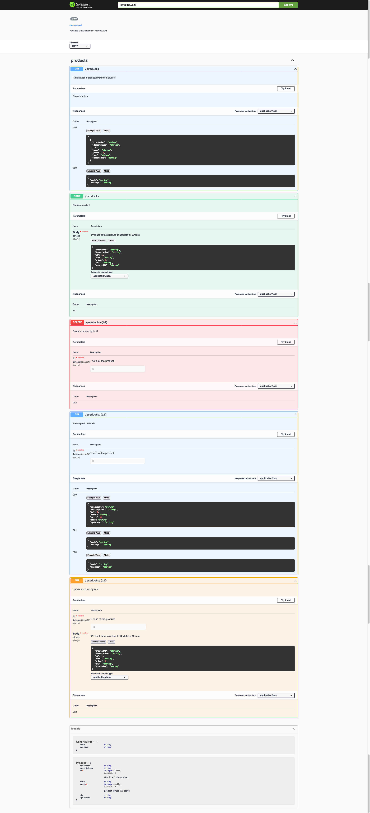

# ep-09: CORS and some other gorilla middleware

* generated [swagger.yaml](./product-api/swagger.yaml)
* generated client [./product-api/client](./product-api/client)

## other references I read

* [gorilla hanlders](https://github.com/gorilla/handlers): some useful middleware
